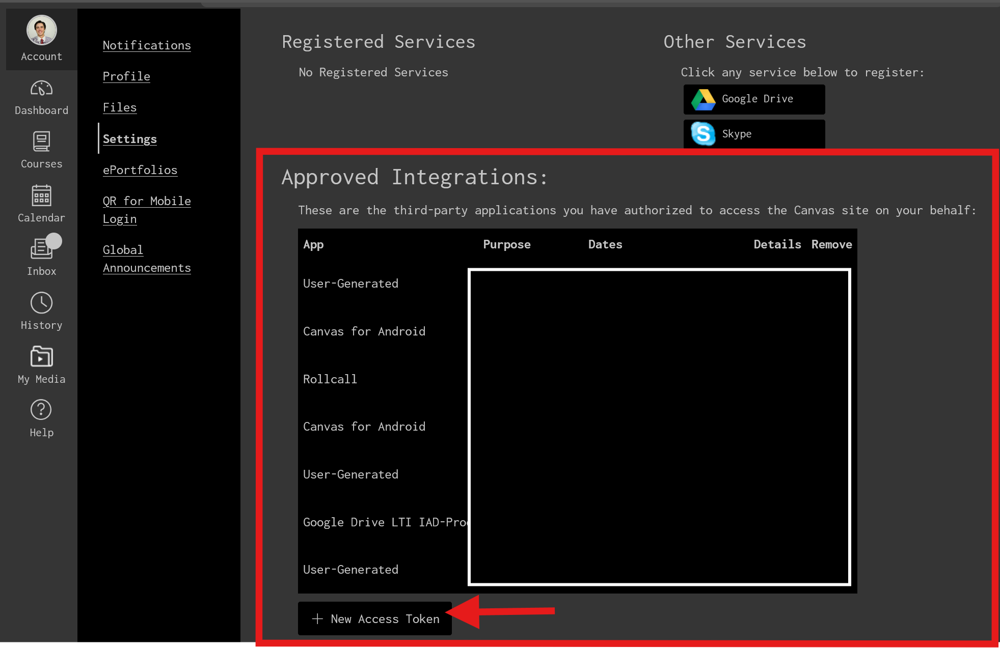
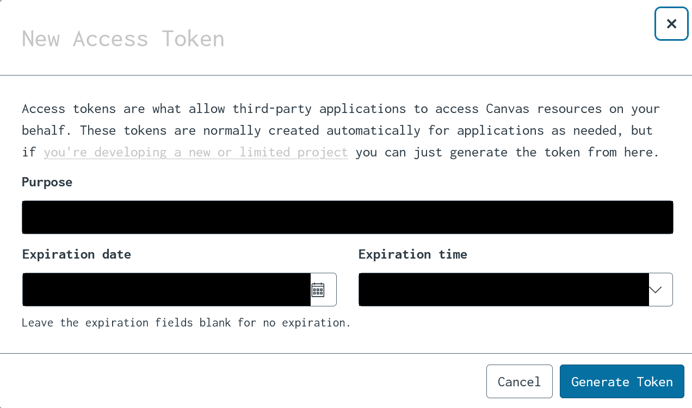
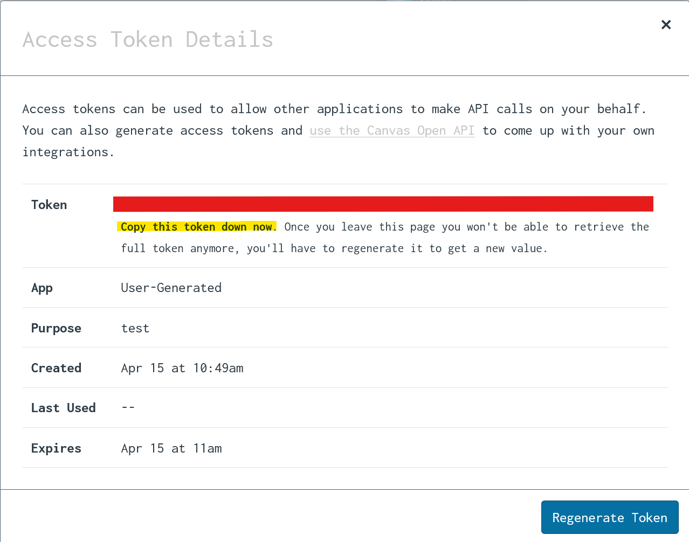
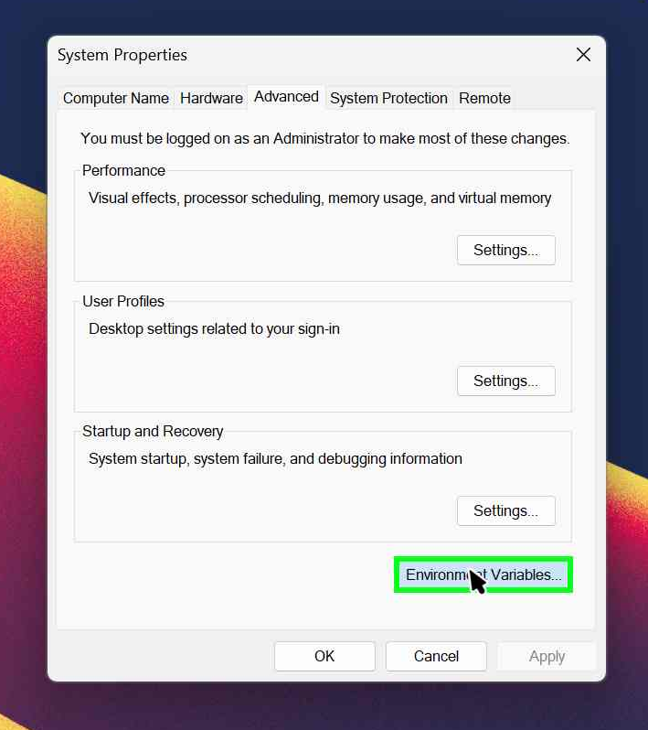
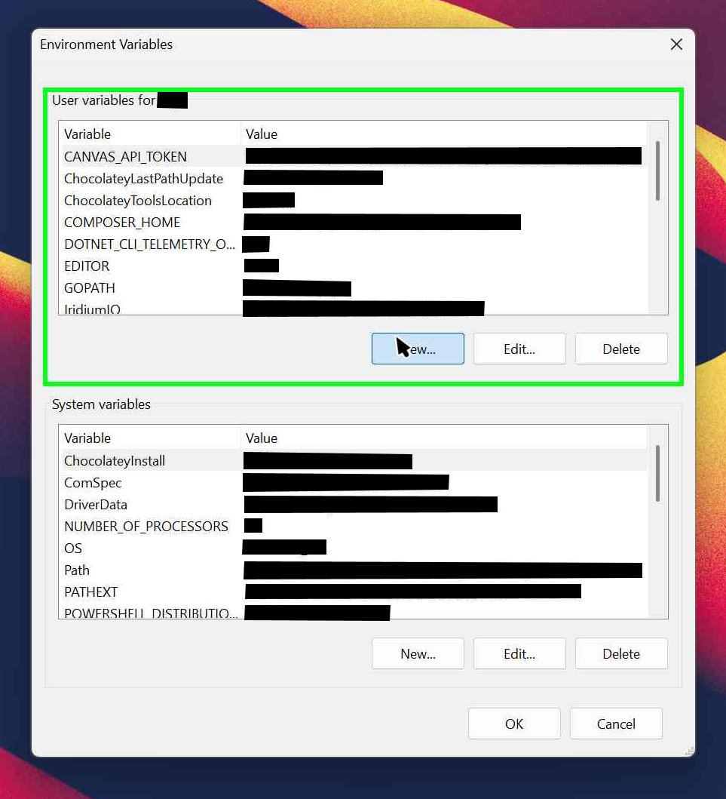
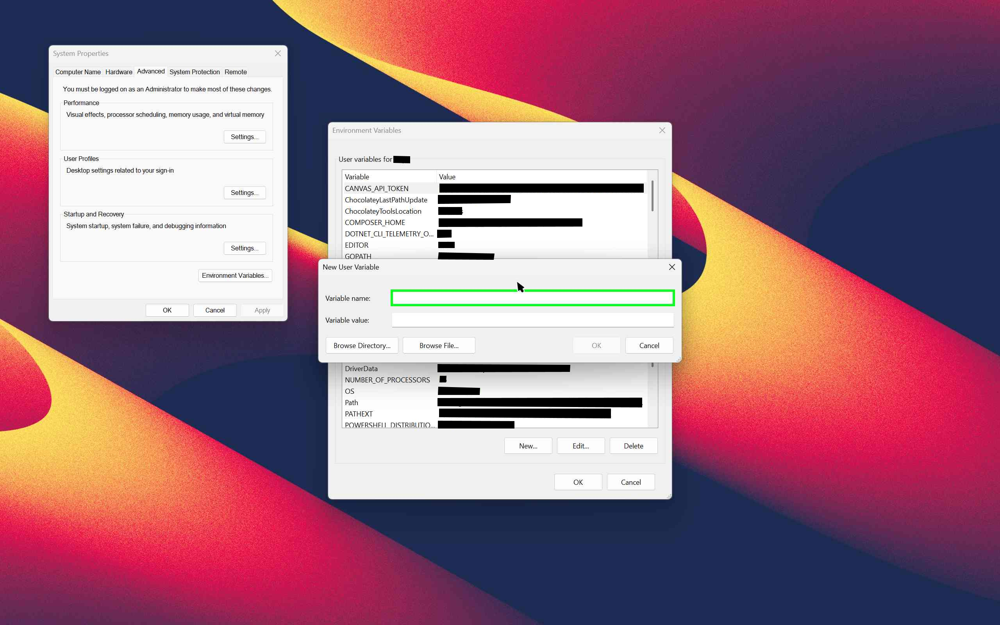

# Getting and Setting your API Token from Canvas

***A guide to setting up your API token with HomeworkTriage***

---

### 1. Go to Canvas

Navigate to your institution's Canvas page. It should look something like this
`MyInstitution.instructure.com`

### 2. Find the settings

On the left side of your screen, selzect the button labeled "Account", then select "Settings"

### 3. Find the Token Generator

Scroll down until you find the section named Approved Integrations. This is where you can view all the devices that have access to your account.

### 4. Create Token

Below the list of integrations, there should be a button labeled "+ New Access Token", click this.



### 5. Set Token Settings

This should make a window pop up that has three fields, **"Purpose"**, **"Expiration date"**, and **"Expiration time"**. **Purpose** is a short description of the purpose of the token—this is to help you remember. **Expiration date and time** are ways to limit the damage that could be done should your token get leaked. If there is a time where you will stop using this token, consider setting this limit. If not, you can leave this blank. However, *if your API token is released on the open internet, anyone with the token will have unlimited access to your Canvas account until you disable that token.*



### 6. Copying the Token

After filling out these fields and selecting "Generate Token," a new window should appear with your new API token.
It'll look something like this (Don't worry, I set this key to expire minutes after I created it):

`10706~rZKyQG9yWMNL4LTm2CxxCzBHDXhmy2x4TPQfenZtM2VHwYqCcP7UM26WXVHHmRhhT`

Copy this and make sure you copied it correctly. It's important that you make sure you have it because once you make it, it will not be accessible again.



# 7. A Word of Warning

As with all API tokens, the key generated here allows full control over your account, so it is extremely important that you do not put it anywhere that would be uploaded publicly. This includes online version control systems like GitHub and GitLab. Do **not** include an unencrypted or plaintext version of this key in ANY of these systems as the chance of your Canvas account being accessed against your will is much, much higher.

### 8. Storing Your API Token in Environment Variables

To store the key securely, we will set it in your system's environment variables. This allows your code to access it without leaving sensitive information in your files.

#### Windows

1. Press `Windows + S` and search for **Environment Variables**.
2. Click on **"Edit the system environment variables"** and then on the **"Environment Variables"** button.

3. Under **User variables**, click **New\...**

4. Set the **Variable name** to  `CANVAS_API_TOKEN`

5. Paste your token into the **Variable value** field
6. Click OK through all dialogs

To verify it works:

```powershell
$env:CANVAS_API_TOKEN
```

#### macOS (bash or zsh)

1. Open your terminal. *This can be done by pressing Command + Space and typing "Terminal" into the text bow that appears.*
2. Find which shell you are using. This should be visible in the title bar of the application. Look for "bash" or "zsh"
3. Open your shell config file by typing the following:
   - For bash: `nano ~/.bash_profile`
   - For zsh: `nano ~/.zshrc`
4. Add the following line:

```bash
export CANVAS_API_TOKEN="your_token_here"
```

4. Save and close the file. In the `nano`editor, you can do this by pressing `Control + X`, then pressing `Y` to confirm saving, and finally `Enter` to confirm the filename.

*If you're using a different terminal editor (like `vim`), the steps may differ slightly, but the key idea is to write the change and exit the file.*

5\. After saving and exiting, reload your shell config by typing:

- `source ~/.bash_profile`
- `source ~/.zshrc`

6. Test it by typing:

```bash
echo $CANVAS_API_TOKEN
```

#### Linux (bash)

Same process as macOS:

1. Edit your shell profile file (usually `~/.bashrc`):

```bash
nano ~/.bashrc
```

2. Add:

```bash
export CANVAS_API_TOKEN="your_token_here"
```

3. Save and reload:

```bash
source ~/.bashrc
```

---

Once your token is set, the HomeworkTriage application will be able to access your Canvas account and see all the assignments and classes you are taking!
